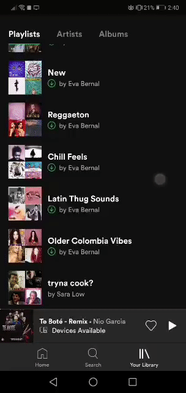

I'm switching my music streaming provider from Google Play Music (GPM) to Spotify and although I could move my music over manually or use apps from the Play Store to do so, I thought it would be funner and most satisfying to write scripts to do it.

I'm leveraging the gmusicapi and Spotipy libraries to communicate with GPM and Spotify.

Since GPM and Spotify manage music in a fundamentally different way (library vs playlists), I've decided to sort the music based on artist, where I'll group by artists into playlists, manually with the help of an interactive script. The interactive sciprt prompts me by artist and I have the option to get more information (what songs I have of the artist). There's also commands to see all my playlists by name, or add more. After prompted with an artist, I can then use "sendto" to indicate that I want that artist to be sent to a specific playlist. This brought down the work from sorting thousands of songs to dozens of artists; the automcompletion feature also cuts down on work required to sort. 

Below is a preview of what's involved:

  <ol>
    <li>
      A "Before" picture, of the equivalent on GPM
    </li>
      
    <li>
      A snippet of the intermediate representation, as received from GPM
    </li>
      
    <li>
      What the sorting may look like, using the interactive script (prompt, create playlist, sendto, view playlist)
    </li>
      
    <li>
      The "After" representation, showing the playlist appearing on Spotify
    </li>
    
  </ol>

